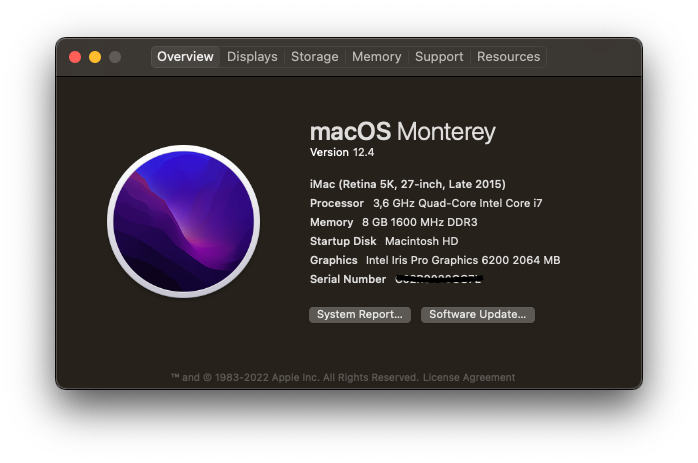
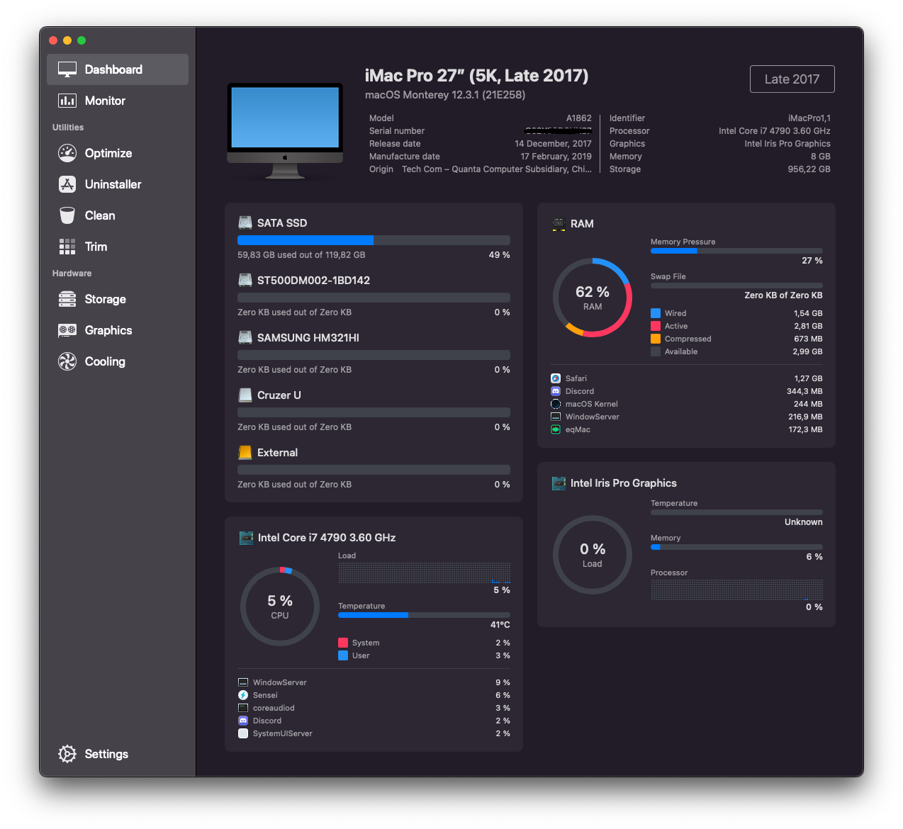

 
 

# Hackintosh Haswell Dekstop
##### Download EFI: [Releases](https://github.com/Naufal828/EFI-HASWELL-DEKSTOP/releases/tag/Release)

**IMPORTANT** 
Before you use this efi, configure smbios on config.plist
and make sure you have your bios settings. This EFI Tested on monterey 12.3.1 and 12.4 work perfectly

- [Platfrom Info ](https://dortania.github.io/OpenCore-Install-Guide/config.plist/haswell.html#platforminfo)
- [Bios Settings](https://dortania.github.io/OpenCore-Install-Guide/config.plist/haswell.html#intel-bios-settings)
- [GenSMBIOS](https://github.com/corpnewt/GenSMBIOS)
- [Monterey Supported Smbios](https://dortania.github.io/OpenCore-Install-Guide/extras/monterey.html#supported-smbios)
- [Mac OS Installer](https://t.me/HackintoshLover/563870)

## Supported SMBIOS
| Type                 |            Comment                |
|----------------------|-----------------------------------|
| iMac17,1             | Haswell desktops with dGPU        |
| iMac16,2             | Haswell desktops with only an iGPU|

## Bios Settings
| Settins              |            Comment                |
|----------------------|-----------------------------------|
| Fast Boot            | Disable                           |
| Secure Boot          | Disable                           |
| Serial/COM Port      | Disable                           |
| Parallel Port        | Disable                           |
| SVT-d                | Disable                           |
| Thunderbolt          | Disable                           |
| Intel SGX            | Disable                           |
| Intel Platform Trust | Disable                           |
| CFG Lock             | Disable                           |
| VT-x                 | Enable                            |
| Above 4G decoding    | Enable                            |
| Hyper-Threading      | Enable                            |
| Execute Disable Bit  | Enable                            |
| OS type:             | Other UEFI Mode                   |
| DVMT Pre-Allocated   | 64Mb                              |
| SATA Mode            | AHCI.                             |

## Hardware

| Type                 | Name                              |
|----------------------|-----------------------------------|
| CPU                  | Intel® Core™ i7-4790              |
| Motherboard          | Asus B85M-G                       |
| Audio                | Realtek® Audio Codec ALC887       |
| IGPU                 | Intel® HD Graphics 4600           |
| Display              | LG 20M35                          |
| RAM                  | 8GB DDR3 1600Mhz                  |
| Ethernet             | Realtek® 8111G Gigabit Lan        |
| Wi-Fi Bluetooth      | none                              |
| Storage              | Maxell SSD 120Gb Sata Interface   |
| Hardisk              | Seagate 500Gb , Samsung 320Gb     |
## Patches & Kexts
 - [[Kext] VirtualSMC](https://github.com/acidanthera/VirtualSMC)
 - [[Kext] Lilu](https://github.com/acidanthera/Lilu)
 - [[Kext] WhateverGreen](https://github.com/acidanthera/WhateverGreen)
 - [[Kext] AppleALC](https://github.com/acidanthera/AppleALC/)
 - [[Kext] RealtekRTL8111](https://github.com/Mieze/RTL8111_driver_for_OS_X/releases)

## Functional

-  QE/CI of Intel® HD Graphics 4600
-  Restart, Sleep and Shutdown
-  CPU Power Management
-  iMessage / FaceTime / iCloud
-  Ethernet
-  HDMI Out
-  All Port USB
-  VDA Decoder Fully Support 

## Doesn't Work
- Wifi
- Bluetooth
- AirDrop
- Appletv or cannot stream netflix, disney+, primevideo. because that need drm gpu compatible *required gpu Polaris+
- etc....

 
## Article
- https://dortania.github.io/OpenCore-Install-Guide/
- https://dortania.github.io/GPU-Buyers-Guide/
- https://dortania.github.io/OpenCore-Post-Install/universal/drm.html#fixing-drm

## Resource
- https://github.com/headkaze/Hackintool
- https://mackie100projects.altervista.org/opencore-configurator/
- https://github.com/corpnewt/ProperTree

## Benchmark Result
- https://browser.geekbench.com/v4/cpu/16558279
- https://browser.geekbench.com/v5/cpu/15095327

## Contact
 - [Contact Us](https://t.me/naufaliosk)

## Support Me
 - [For Buy a coffee](https://saweria.co/Naufaal)

## Special Thanks to
- [God](https://id.wikipedia.org/wiki/Tuhan)
- [Apple](https://www.apple.com) For MacOS
- [Acidantera](https://github.com/acidanthera) The maker of OpenCore
- [Dortania People](https://github.com/orgs/dortania/people) for the OpenCore Install Guide
- [Admin and all member group H4CK1NTOSH L0V3R](https://t.me/HackintoshLover) the best group evvawhh

## Screenshot

